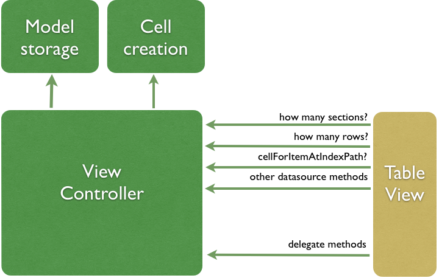
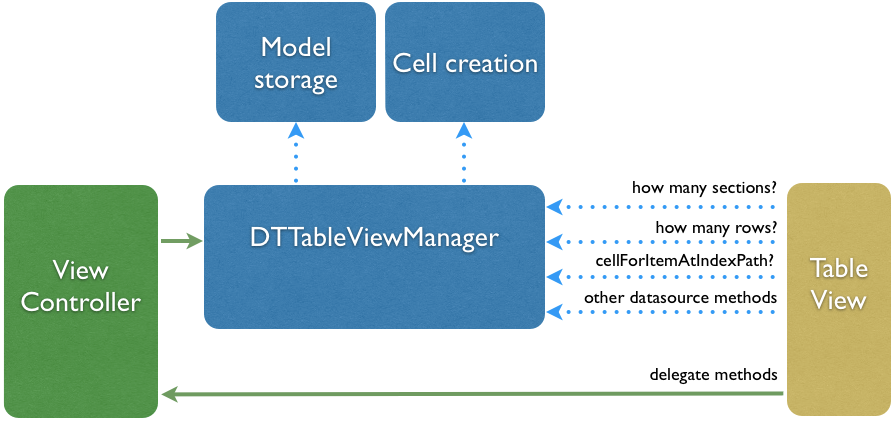

 &nbsp;
 &nbsp; 
 &nbsp; 


DTTableViewManager
================
> This is a sister-project for [DTCollectionViewManager](https://github.com/DenHeadless/DTCollectionViewManager) - great tool for UICollectionView management, built on the same principles.

Target of this project is to create powerful architecture for UITableView сontrollers. It combines several ideas to make UITableView management easy, clean, and delightful. 

## 2.0

DTTableViewManager 2.0 is a major update to the framework, introducing big changes to the architecture and bringing several powerful features. 

**Read the [DTTableViewManager 2.0 Transition Guide](https://github.com/DenHeadless/DTTableViewManager/wiki/DTTableViewManager-2.0-Transition-Guide) for an overview of the architectural and API changes.**

### What's new

* Refactored and more modular architecture
* Support for CoreData/NSFetchedResultsController
* Support for custom data storage objects

## Features

* Powerful mapping system between data models and table view cells, headers and footers
* Automatic datasource and interface synchronization.
* Support for creating cells from code, XIBs or storyboards.
* Easy UITableView search 
* Core data / NSFetchedResultsController support

The best way to understand, what we are trying to achieve here, is to take a look at example, that shows most common use cases for framework. It is provided in Example folder. Don't miss CoreData examples, they are awesome!

## Picture time!

Lets imagine view controller, that manages table view presentation on itself. 

<p align="center" >
  
</p>

Clearly, there are way to many connections, that your view controller needs to handle. And we only show table view stuff, however most likely your view controller is also doing other things, which will make this graph much more complicated. 

Solution for this - separate datasource from view controller. DTTableViewManager does just that. Here's how picture looks, when we use it:

<p align="center" >
  
</p>

In the end, view controller is left with following stuff:

* Register mapping between data model class and cell class.
* Populate data storage with data models

Okay, enough talking, let's dive into code. Simplest way for view controller is to subclass `DTTableViewController`, set it's tableView property, delegate, datasource and off you go!

## Mapping

* Cells

```objective-c
[self registerCellClass:[Cell class] forModelClass:[Model class]];
```

* Headers/Footers

```objective-c
[self registerHeaderClass:[HeaderView class] forModelClass:[Model class]];
[self registerFooterClass:[FooterView class] forModelClass:[Model class]];
```

This will also register nibs with `Cell`, `HeaderView` and `FooterView` name, if any of them exist. 

If you use storyboards and prototype cells, you will need to set reuseIdentifier for corresponding cell in storyboard.

# Managing table items

Starting with 2.1, storage classes for DTTableViewManager have been moved to [separate repo](https://github.com/DenHeadless/DTModelStorage). Two data storage classes are provided - memory and core data storage. Let's start with `DTTableViewMemoryStorage`, that is used by default.

### Memory storage

`DTMemoryStorage` encapsulates storage of table view data models in memory. It's basically NSArray of `DTSectionModel` objects, which contain array of objects for current section, section header and footer model.

To work with memory storage, you will need to get it's instance from your `DTTableViewController` subclass.

```objective-c
- (DTTableViewMemoryStorage *)memoryStorage;
```

**You can take a look at all provided methods for manipulating items here: [DTMemoryStorage methods](https://github.com/DenHeadless/DTModelStorage/blob/master/README.md#adding-items)**

In most cases, adding items to memory storage is as simple as calling:

```objective-c
- (void)addItem:(NSObject *)item;
- (void)addItems:(NSArray *)items toSection:(NSInteger)sectionNumber;
```

##### DTTableViewMemoryStorage

`DTTableViewMemoryStorage` is a subclass of `DTMemoryStorage`, that adds adds several methods, that are specific to UITableView. Two most relevant of them are 

```objective-c
- (void)setSectionHeaderModels:(NSArray *)headerModels;
- (void)setSectionFooterModels:(NSArray *)footerModels;
```
These methods allow setting header and footer models for multiple sections in single method call.

##### Search
	
Set UISearchBar's delegate property to your `DTTableViewController` subclass. 	
Data models should conform to `DTModelSearching` protocol. You need to implement method

```objective-c
- (BOOL)shouldShowInSearchResultsForSearchString:(NSString*)searchString
                                    inScopeIndex:(int)scope;
```

on your data model, this way DTTableViewManager will know, when to show data models.

Searching data storage will be created automatically for current search, and it will be used as a datasource for UITableView.
	
### Core Data storage

`DTCoreDataStorage` is meant to be used with NSFetchedResultsController. It automatically monitors all NSFetchedResultsControllerDelegate methods and updates UI accordingly to it's changes. All you need to do to display CoreData models in your UITableView, is create DTCoreDataStorage object and set it on your DTTableViewController subclass.

```objective-c
self.dataStorage = [DTCoreDataStorage storageWithFetchResultsController:controller];
```	

##### Search

Subclass DTCoreDataStorage and implement single method 
```objective-c
- (instancetype)searchingStorageForSearchString:(NSString *)searchString
                                  inSearchScope:(NSInteger)searchScope;
```	

You will need to provide a storage with NSFetchedResultsController and appropriate NSPredicate. Take a look at example application, that does just that.
	
## Convenience classes and methods

Most of the time you will have data model classes and UITableViewCell subclasses, that display models. However, sometimes you would want something more simple. For example, headers and footers might only need NSString as data model. You can use several Foundation types for that purpose. 

[Note on using Foundation types as data models](https://github.com/DenHeadless/DTTableViewManager/wiki/Foundation-classes-as-data-models-for-DTTableViewManager)

Sometimes you may also want to use predefined UITableViewCell styles for simple UITableViewCell. You can do that by creating `DTDefaultCellModel`:

```objective-c
+(instancetype)modelWithCellStyle:(UITableViewCellStyle)style
                  reuseIdentifier:(NSString *)reuseIdentifier
               configurationBlock:(DTCellConfigurationBlock)configurationBlock
                   searchingBlock:(DTModelSearchingBlock)searchBlock;
```

Similarly, there's also `DTDefaultHeaderFooterModel`:

```objective-c
+(instancetype)modelWithReuseIdentifier:(NSString *)reuseIdentifier
                     configurationBlock:(DTHeaderFooterViewConfigurationBlock)configurationBlock;
```

Just add default models to memory storage, no mapping required for those.

## Requirements

* iOS 6.0
* XCode 5
        
## Installation

Simplest option is to use [CocoaPods](http://www.cocoapods.org):

	pod 'DTTableViewManager', '~> 2.1.0'

## Documentation

You can view documentation online or you can install it locally using [cocoadocs](http://cocoadocs.org/docsets/DTTableViewManager)!

## Thanks

* [Alexey Belkevich](https://github.com/belkevich) for providing initial implementation of CellFactory.
* [Michael Fey](https://github.com/MrRooni) for providing insight into NSFetchedResultsController updates done right. 

[](https://bitdeli.com/free "Bitdeli Badge")

